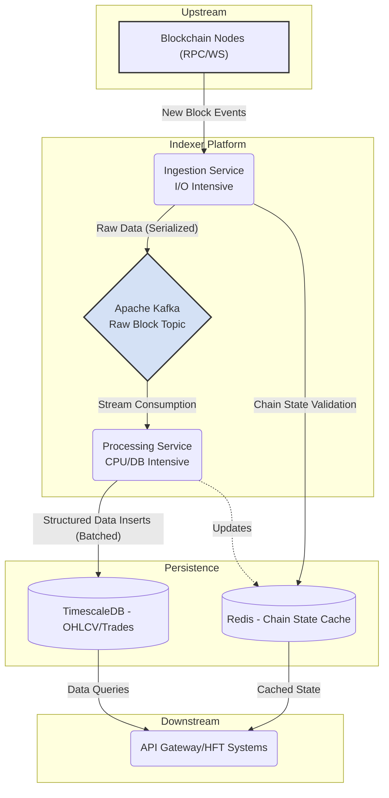
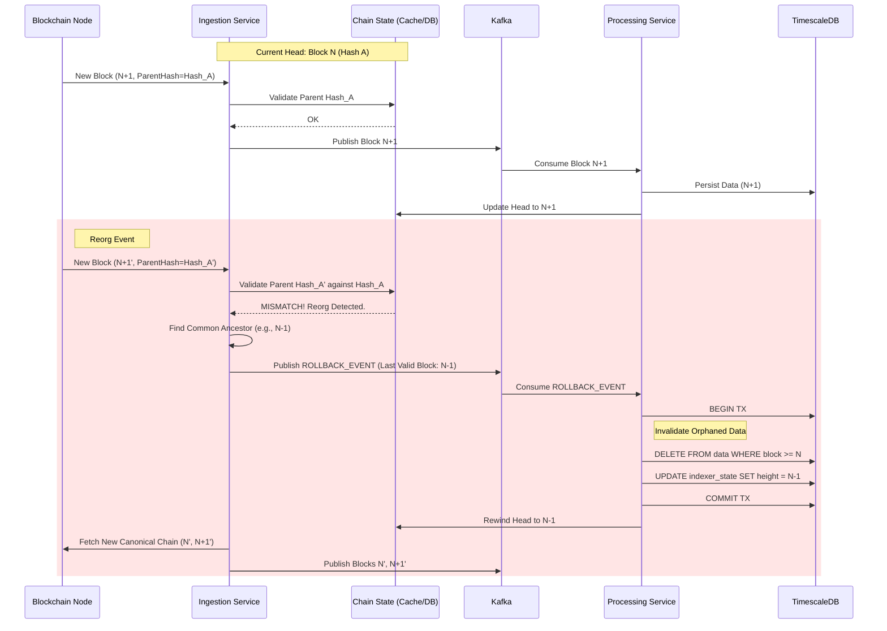

# High-Throughput Blockchain Indexer (HTBI)

## Architectural Reference & Disclaimer

This repository serves as an **architectural blueprint** and **system design demonstration** for a high-throughput, low-latency blockchain indexer tailored for financial applications (specifically HFT/DEX environments like Paradex).

> ⚠️ **Note:** Due to strict Non-Disclosure Agreements (NDAs), the source code cannot be made public. This document details the design choices, trade-offs, data consistency models, and strategies for handling the complexities of real-time blockchain data ingestion, focusing on concurrency, data integrity, and resilience against chain reorganizations (Reorgs).

---

## 1. System Overview

The High-Throughput Blockchain Indexer (HTBI) is a **distributed, event-driven system** designed to ingest, parse, and store EVM/L2 blockchain data (Blocks, Transactions, Event Logs) in real-time. The primary objective is to provide **sub-second latency** access to derived financial data (e.g., OHLCV candles, liquidity states, trade events) while maintaining **strict data integrity**.

The architecture is decoupled into distinct services to ensure independent scaling and fault tolerance:

| Service | Technology | Responsibility |
|---------|------------|----------------|
| **Ingestion Service** | Java 21/Loom | Manages persistent connections (WebSocket and RPC) to multiple blockchain nodes. Performs initial block validation, detects potential reorgs, and publishes raw, serialized block data to Kafka. |
| **Processing Service** | Java 21/Spring Boot | Consumes raw data from Kafka, decodes transactions (using Web3j/ABI specifications), applies business logic (e.g., calculating trade prices, aggregating OHLCV), and persists the structured data. |
| **Data Storage** | TimescaleDB/PostgreSQL | A time-series optimized relational database used for storing high-frequency trade data, facilitating efficient range queries and aggregations. |
| **State Cache** | Redis | Used for maintaining the current chain state (latest block hash/height) for rapid validation during ingestion. |

### 1.1. Data Flow Diagram

---

## 2. The Reorg Challenge (Deep Chain Validation)

In decentralized consensus systems, the tip of the chain is often **probabilistic**. Chain reorganizations (Reorgs) occur when a node switches its view of the canonical chain to a different fork (e.g., due to network latency or consensus attacks).

> For a financial indexer, processing a block that is later orphaned leads to **corrupted data states** and **financial discrepancies**.

### 2.1. Strategy: Optimistic Confirmation vs. Finality

| Strategy | Description | Trade-off |
|----------|-------------|-----------|
| **Waiting for Finality** | Waiting for sufficient block confirmations (6-12 blocks) or explicit finality gadgets (L2s) | Strong guarantees but introduces unacceptable latency for HFT environments |
| **Optimistic Confirmation** | Processing blocks immediately upon detection | Minimal latency but requires robust, instantaneous reorg detection and handling |

**HTBI employs Optimistic Confirmation coupled with Real-time Deep Chain Validation.**

### 2.2. Reorg Handling Mechanism

1. **New Block Arrival:** The Ingestion Service receives Block N+1.
2. **Parent Hash Check:** The system retrieves the hash of the previously indexed canonical Block N (from the Redis State Cache or DB).
3. **Validation:** It compares `Block_N+1.parentHash` with `Block_N.hash`.
   - **Match:** The chain is consistent. Block N+1 is published to Kafka.
   - **Mismatch:** A Reorg is detected. The previously indexed Block N is now orphaned.

**When a mismatch occurs:**

1. **Halt Forward Progress:** Pause processing of new blocks temporarily.
2. **Signal Rollback:** A `ROLLBACK_EVENT` message is published to a dedicated, high-priority Kafka topic, indicating the last valid block height (the "common ancestor", e.g., N-1).
3. **Invalidate State:** The Processing Service consumes the `ROLLBACK_EVENT`. It initiates a database transaction to delete all data derived from the orphaned blocks (Blocks N and potentially others if the reorg depth > 1).
4. **Rewind & Reprocess:** The Ingestion Service fetches the new canonical fork (starting from the new Block N') and publishes it, allowing the system to converge to the correct state.

### 2.3. Reorg Sequence Diagram

---

## 3. Key Architectural Decisions (Trade-offs)

### 3.1. Why Java 21 (Project Loom) over Node.js/Go?

While Node.js excels at asynchronous I/O and Go offers lightweight concurrency via Goroutines, **Java 21** was selected for this critical financial infrastructure due to:

| Factor | Rationale |
|--------|-----------|
| **Virtual Threads (Project Loom)** | Blockchain indexing is heavily I/O-bound (maintaining thousands of WebSocket connections, waiting for RPC responses, database acknowledgments). Virtual Threads allow us to adopt a simple, synchronous "thread-per-request" programming model without the overhead and scaling limitations of platform (OS) threads. This vastly simplifies concurrent code, making it easier to debug and maintain compared to complex reactive chains (WebFlux) or callback structures, while achieving massive scalability. |
| **Strong Typing and Financial Integrity** | Java's strong, static type system minimizes the risk of runtime errors common in dynamically typed languages (like JavaScript/Python). This is critical when handling financial calculations, BigInteger precision (for Wei), and complex data structures where correctness is paramount. |
| **Ecosystem Maturity and Performance** | The maturity of libraries like the Confluent Kafka Client, Web3j, and the Spring ecosystem provides robust tooling. Furthermore, modern JVMs with advanced Garbage Collectors (like ZGC) offer predictable low-pause times crucial for low-latency applications. |

### 3.2. Why Apache Kafka over RabbitMQ?

The choice of the message broker is fundamental to the pipeline's reliability and flexibility. **Kafka** was chosen over traditional message queues like RabbitMQ for the following reasons:

| Factor | Rationale |
|--------|-----------|
| **Replayability (Log-based Architecture)** | Kafka treats the data stream as an immutable, append-only log. Messages are retained based on configuration, not just consumption. This is essential. If we deploy a new version of the Processing Service with updated parsing logic or need to recover from a failure, we can simply replay the entire history of raw block data from Kafka to rebuild the database state deterministically. |
| **Strict Ordering Guarantees** | Blockchain data MUST be processed sequentially. Kafka guarantees strict ordering of messages within a partition. By keying the Kafka messages appropriately, we ensure blocks are processed in the correct order, simplifying state management. |
| **High Throughput and Scalability** | Kafka is designed for high-volume, persistent data streams and scales horizontally more effectively than RabbitMQ for this type of workload, handling potential backpressure gracefully. |

---

## 4. Data Consistency & Reliability

Ensuring data integrity despite network failures, service restarts, and chain reorganizations is fundamental.

### 4.1. Idempotency and Exactly-Once Semantics (EOS)

We aim for effective **Exactly-Once Semantics (EOS)** to prevent duplicate data entries if a message is processed multiple times (e.g., due to a consumer failure before committing offsets).

- **Deterministic Primary Keys:** We define primary keys based on immutable blockchain properties. For example, an event log entry is uniquely identified by `(ChainID, BlockNumber, TransactionHash, LogIndex)`.

- **Idempotent Writes:** Database inserts use PostgreSQL's `INSERT ... ON CONFLICT DO NOTHING` (or `DO UPDATE` where appropriate). If the system attempts to insert the same data twice, the second attempt is safely ignored without corrupting the state.

### 4.2. Atomic Writes and State Management

A critical consistency challenge is ensuring that the database state and the "Last Indexed Block" marker are updated **atomically**. If they diverge, the system may lose data or process duplicates upon restart.

**Solution:** We store the consumer progress marker (the last successfully indexed block height) within the TimescaleDB itself, in a dedicated `indexer_state` table. The business data (trades, events) and the progress marker are committed within the **same ACID transaction**. This guarantees that the stored data always reflects the recorded progress.

---

## 5. Performance Tuning

To meet the high-throughput and low-latency requirements, several optimizations are implemented:

### 5.1. Database Optimization

| Optimization | Description |
|--------------|-------------|
| **JDBC Batch Processing** | The Processing Service utilizes JDBC batch inserts (`executeBatch()`). Instead of inserting records one by one, we accumulate records (e.g., all events within a block) and insert them in a single database round trip. This significantly reduces transaction overhead and increases insertion throughput by orders of magnitude. |
| **TimescaleDB Hypertables** | Utilizing Hypertables for time-series data ensures efficient partitioning (e.g., daily chunks), maintaining fast query performance on recent data. |

### 5.2. Kafka Optimization

| Configuration | Value | Rationale |
|---------------|-------|-----------|
| **Producer Batching (`linger.ms`)** | 5-10ms | Set slightly above zero to allow the producer to accumulate messages into larger batches before sending, improving throughput and compression efficiency at the cost of minor latency. |
| **Compression (`compression.type`)** | `lz4` or `zstd` | Compresses raw block data, reducing network bandwidth and storage requirements in Kafka. |
| **Acknowledgements (`acks`)** | `all` | Ensures maximum durability, guaranteeing that data is replicated across multiple brokers before the write is considered successful. |

---

## License

This architectural documentation is provided for educational and reference purposes only.
