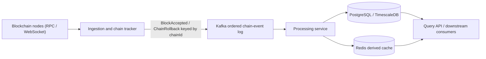
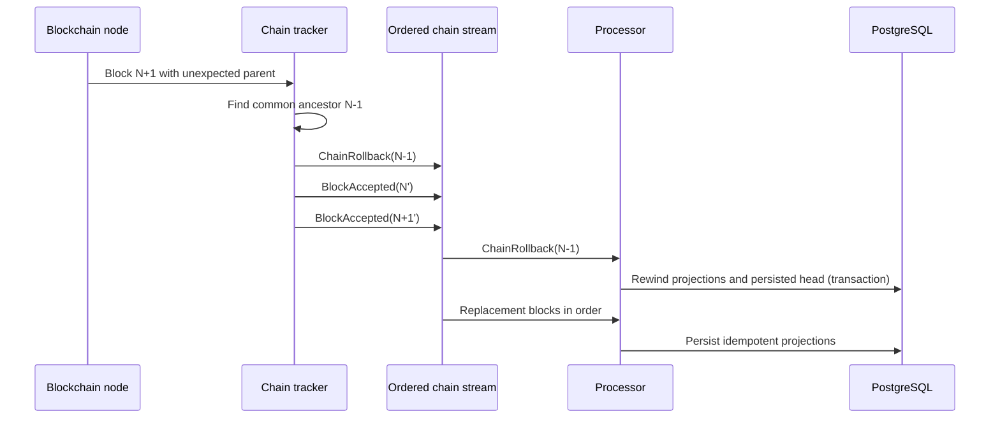

# Reliable Blockchain Indexer — Architecture Case Study

## Scope and evidence level

This repository is a **documentation-only architecture case study** for an EVM/L2 blockchain indexer. It discusses design choices for low-latency ingestion, chain reorganizations, Kafka ordering, idempotent persistence, and recovery.

It does **not** contain a public implementation, deployment, benchmark, or production configuration. The design is a conceptual reconstruction informed by professional experience on private and confidentiality-constrained systems; it does not disclose proprietary source code or client-specific details.

The goal is to make the guarantees, failure modes, and trade-offs reviewable without overstating what this public repository proves.

## 1. Problem statement

An indexer ingests blocks, transactions, and event logs, then derives queryable data such as trades, balances, or time-series aggregates. The difficult part is not parsing the happy path. It is remaining correct when:

- a node changes its view of the canonical chain;
- messages are delivered more than once;
- a consumer crashes between a database commit and an offset commit;
- ingestion and processing progress at different speeds;
- a deployment changes event or database schemas;
- downstream state must be rebuilt from retained events.

This case study favors low-latency, optimistic processing. Applications that cannot tolerate temporary exposure to non-final data should wait for chain-specific finality instead.

## 2. Conceptual architecture

| Component | Illustrative technology | Responsibility |
| --- | --- | --- |
| Ingestion and chain tracker | Java 21 | Reads RPC/WebSocket sources, validates parent links, owns the accepted chain head, and emits ordered chain events. |
| Ordered event log | Apache Kafka | Retains accepted blocks and rollback control events in per-chain order. |
| Processing service | Spring Boot | Decodes data, applies domain logic, and persists idempotent projections. |
| System of record | PostgreSQL / TimescaleDB | Stores projections, processed-event identifiers, and persisted processing progress. |
| Derived cache | Redis | Serves rebuildable read state; it is not the authority for canonical-chain decisions. |



### Authority boundaries

The ingestion component owns its accepted canonical head. The processing component owns its persisted projection progress. These are deliberately separate concepts:

- **accepted head:** the latest chain event accepted and emitted by ingestion;
- **persisted head:** the latest chain event committed to the projection database;
- **finalized head:** the latest block considered final according to chain-specific rules.

Redis may cache these values for reads, but it must not become the sole source of truth for validation or recovery.

## 3. Ordering model

Kafka guarantees ordering only within a partition. The design therefore keys chain events by `chainId` and routes events for one chain through the same ordered partition or an equivalently fenced single-writer stream.

The stream contains both data and control records:

- `BlockAccepted`
- `ChainRollback`

Rollback records are not placed on a separate "high-priority" topic because Kafka provides no ordering guarantee across topics. Keeping control and block events in the same per-chain order prevents later blocks from overtaking a rollback instruction.

This choice also defines a scaling limit: work for different chains can be parallelized, while state transitions for one chain remain sequential. Parallel processing within a block requires an additional aggregation barrier before the persisted head can advance.

## 4. Reorganization handling

When a new block does not reference the currently accepted parent:

1. ingestion stops advancing that chain's accepted head;
2. it walks parent links to find a common ancestor within a configured maximum depth;
3. it emits `ChainRollback(commonAncestor)` in the ordered chain stream;
4. it emits the replacement canonical blocks after the rollback record;
5. processing consumes the rollback before the replacement blocks;
6. projection changes and the persisted head are rewound in a database transaction;
7. derived cache entries are invalidated or rebuilt after the database commit.



Production designs must additionally define maximum rollback depth, behavior when no ancestor is found, provider disagreement, finality rules, and how expensive derived aggregates are rebuilt.

## 5. Delivery and database semantics

This design assumes **at-least-once delivery with idempotent database effects**. It does not claim end-to-end exactly-once processing across Kafka and PostgreSQL.

Each consumed event has a stable identifier. A database transaction should atomically:

1. claim or insert the event identifier in an inbox table;
2. apply the projection changes;
3. update the persisted chain progress;
4. commit.

The Kafka offset is committed only after the database transaction succeeds. A crash after the database commit but before the offset commit causes redelivery; the inbox record makes that redelivery a no-op.

Example identifiers include:

```text
(chainId, blockHash)
(chainId, transactionHash, logIndex)
```

Block number alone is not sufficient because different forks can contain different blocks at the same height.

## 6. Replay and schema evolution

Kafka retention can support projection rebuilds, but deterministic replay requires more than resetting offsets:

- immutable, versioned event contracts;
- retained decoder and ABI versions;
- deterministic domain calculations;
- migration rules for old event versions;
- a separate consumer group or isolated rebuild environment;
- reconciliation before switching read traffic to the rebuilt projection.

Replayability is therefore a design goal, not an automatic consequence of using Kafka.

## 7. Performance considerations

Potential tuning mechanisms include JDBC batching, bounded consumer batches, suitable TimescaleDB chunking, Kafka compression, and producer batching. Their values must be derived from measurements rather than copied into a reference configuration.

A credible benchmark would report:

- dataset and block/event distribution;
- hardware and JVM configuration;
- producer and consumer configuration;
- throughput and end-to-end latency at p50, p95, and p99;
- consumer lag and database saturation;
- recovery time after a consumer restart or rollback;
- correctness checks performed after the run.

No performance result is claimed by this repository today.

## 8. Reliability and operational questions

The following concerns remain intentionally explicit rather than hidden behind a "production-ready" label:

- How is a single active chain writer elected and fenced?
- How are RPC providers compared when they disagree?
- What is the maximum supported reorg depth?
- How are poison events quarantined without breaking chain order?
- How are event and database schemas migrated?
- How are projections reconciled after replay?
- Which metrics define ingestion delay, processing delay, and finality delay?
- What recovery point and recovery time objectives are required?

These questions should be answered by an implementation, automated failure tests, and operational runbooks before production claims are made.

## 9. Why Java and Kafka?

Java offers a mature ecosystem for Kafka, PostgreSQL, observability, and strongly typed domain modelling. Java 21 virtual threads may simplify blocking I/O paths, but their suitability depends on the chosen clients, pinning behavior, and profiling results.

Kafka is useful here because it provides a retained ordered log per partition and independent consumer groups. It does not by itself provide global ordering, priority delivery, database atomicity, or deterministic replay; those properties must be designed explicitly.

## License

This architectural documentation is available under the MIT License. Third-party products and technologies mentioned remain subject to their own licenses.
