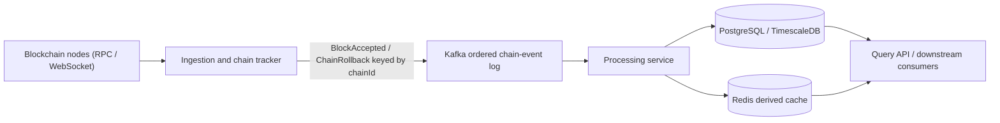
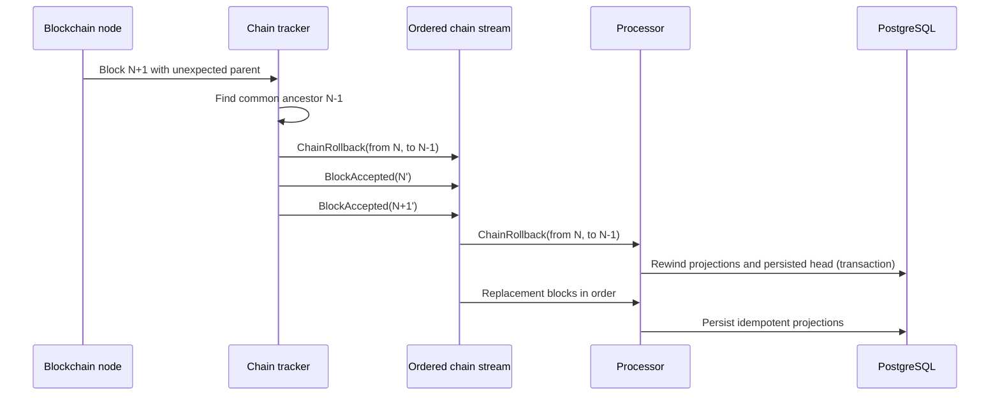

# Reliable Blockchain Indexer — Architecture Case Study

> **TL;DR — the guarantees this design relies on**
>
> - Blocks and rollbacks for one chain share a single ordered stream, so a rollback can never be overtaken by later blocks.
> - Delivery is at-least-once; effects are made idempotent in PostgreSQL. No end-to-end exactly-once claim.
> - Every projected row is tagged with the block it came from, so a reorganization can undo it.
> - The consumer's Kafka position is committed in the same database transaction as the projections.
> - Event handlers check the persisted chain state instead of an inbox of event IDs, which [breaks under reorgs](#53-why-an-event-id-inbox-is-not-enough-with-reorgs).
> - Replay is a designed capability (versioned contracts, retained decoders), not a side effect of Kafka retention.

## Scope and evidence level

This repository is a **documentation-only architecture case study** for an EVM/L2 blockchain indexer. It discusses design choices for low-latency ingestion, chain reorganizations, Kafka ordering, idempotent persistence, and recovery.

It does **not** contain a public implementation, deployment, benchmark, or production configuration. The design is a conceptual reconstruction informed by professional experience on private and confidentiality-constrained systems; it does not disclose proprietary source code or client-specific details.

The goal is to make the guarantees, failure modes, and trade-offs reviewable without overstating what this public repository proves.

## 1. Problem statement

An indexer ingests blocks, transactions, and event logs, then derives queryable data such as trades, balances, or time-series aggregates. The difficult part is not parsing the happy path. It is remaining correct when:

- a node changes its view of the canonical chain;
- messages are delivered more than once;
- a consumer crashes between a database commit and an offset commit;
- ingestion and processing progress at different speeds;
- a deployment changes event or database schemas;
- downstream state must be rebuilt from retained events.

This case study favors low-latency, optimistic processing. Applications that cannot tolerate temporary exposure to non-final data should wait for chain-specific finality instead.

## 2. Conceptual architecture

| Component | Illustrative technology | Responsibility |
| --- | --- | --- |
| Ingestion and chain tracker | Java 21 | Reads RPC/WebSocket sources, validates parent links, owns the accepted chain head, and emits ordered chain events. |
| Ordered event log | Apache Kafka | Retains accepted blocks and rollback control events in per-chain order. |
| Processing service | Spring Boot | Decodes data, applies domain logic, and persists idempotent projections. |
| System of record | PostgreSQL / TimescaleDB | Stores projections, applied blocks, consumer positions, and persisted processing progress. |
| Derived cache | Redis | Serves rebuildable read state; it is not the authority for canonical-chain decisions. |


```mermaid
flowchart LR
    Nodes["Blockchain nodes (RPC / WebSocket)"] --> Ingest["Ingestion and chain tracker"]
    Ingest -->|"BlockAccepted / ChainRollback keyed by chainId"| Kafka["Kafka ordered chain-event log"]
    Kafka --> Processor["Processing service"]
    Processor --> DB[("PostgreSQL / TimescaleDB")]
    Processor --> Cache[("Redis derived cache")]
    DB --> API["Query API / downstream consumers"]
    Cache --> API
```

### Authority boundaries

The ingestion component owns its accepted canonical head. The processing component owns its persisted projection progress. These are deliberately separate concepts:

- **accepted head:** the latest chain event accepted and emitted by ingestion;
- **persisted head:** the latest chain event committed to the projection database;
- **finalized head:** the latest block considered final according to chain-specific rules.

Redis may cache these values for reads, but it must not become the sole source of truth for validation or recovery.

## 3. Ordering model

Kafka guarantees ordering only within a partition. The design therefore keys chain events by `chainId` and routes events for one chain through the same ordered partition or an equivalently fenced single-writer stream.

The stream contains both data and control records:

- `BlockAccepted`
- `ChainRollback`

Rollback records are not placed on a separate "high-priority" topic because Kafka provides no ordering guarantee across topics. Keeping control and block events in the same per-chain order prevents later blocks from overtaking a rollback instruction.

This choice also defines a scaling limit: work for different chains can be parallelized, while state transitions for one chain remain sequential. Parallel processing within a block requires an additional aggregation barrier before the persisted head can advance.

## 4. Reorganization handling

When a new block does not reference the currently accepted parent:

1. ingestion stops advancing that chain's accepted head;
2. it walks parent links to find a common ancestor within a configured maximum depth;
3. it emits `ChainRollback(from = accepted head, to = commonAncestor)` in the ordered chain stream;
4. it emits the replacement canonical blocks after the rollback record;
5. processing consumes the rollback before the replacement blocks;
6. projection changes and the persisted head are rewound in a database transaction;
7. derived cache entries are invalidated or rebuilt after the database commit.


```mermaid
sequenceDiagram
    participant Node as Blockchain node
    participant Ingest as Chain tracker
    participant Kafka as Ordered chain stream
    participant Proc as Processor
    participant DB as PostgreSQL

    Node->>Ingest: Block N+1 with unexpected parent
    Ingest->>Ingest: Find common ancestor N-1
    Ingest->>Kafka: ChainRollback(from N, to N-1)
    Ingest->>Kafka: BlockAccepted(N')
    Ingest->>Kafka: BlockAccepted(N+1')
    Kafka->>Proc: ChainRollback(from N, to N-1)
    Proc->>DB: Rewind projections and persisted head (transaction)
    Kafka->>Proc: Replacement blocks in order
    Proc->>DB: Persist idempotent projections
```

Production designs must additionally define maximum rollback depth, behavior when no ancestor is found, provider disagreement, finality rules, and how expensive derived aggregates are rebuilt.

## 5. Delivery and database semantics

This design assumes **at-least-once delivery with idempotent database effects**. It does not claim end-to-end exactly-once processing across Kafka and PostgreSQL.

Idempotency comes from two mechanisms, both committed in the same database transaction as the projection changes:

- the consumer's Kafka position, which makes redelivery after a crash a no-op;
- checks against the persisted chain state, which make duplicate records in the log harmless.

### 5.1 Consumer position stored with the projections

For each Kafka partition it consumes, the processor stores the offset of the next record to apply, in the same transaction as the projection changes. When a partition is assigned, it seeks to that stored offset. This is the "storing offsets outside Kafka" pattern described in the [`KafkaConsumer` documentation](https://kafka.apache.org/35/javadoc/org/apache/kafka/clients/consumer/KafkaConsumer.html), implemented with a `ConsumerRebalanceListener` and `seek()`.

A crash after the database commit can no longer cause a record to be applied twice: on restart, the consumer resumes from the position stored with the data it already applied. Advancing the position with a compare-and-set (`UPDATE ... SET next_offset = :next WHERE topic = :t AND partition = :p AND next_offset = :expected`) also fences a consumer that lost the partition during a rebalance but is still processing: its update matches no row, and its transaction is rolled back.

```sql
CREATE TABLE consumer_position (
    topic       text   NOT NULL,
    partition   int    NOT NULL,
    next_offset bigint NOT NULL,
    PRIMARY KEY (topic, partition)
);
```

### 5.2 State checks for chain events

The log itself can still contain duplicates, for example when a chain tracker restarts and re-emits blocks. Each handler is therefore idempotent with respect to the persisted chain state:

```sql
-- Blocks whose effects are currently applied; the persisted head is the highest one.
CREATE TABLE chain_block (
    chain_id    bigint NOT NULL,
    number      bigint NOT NULL,
    hash        bytea  NOT NULL,
    parent_hash bytea  NOT NULL,
    PRIMARY KEY (chain_id, number)
);

-- Projection rows carry the block they come from, so a rollback can delete them.
CREATE TABLE token_transfer (
    chain_id     bigint  NOT NULL,
    block_number bigint  NOT NULL,
    block_hash   bytea   NOT NULL,
    log_index    int     NOT NULL,
    tx_hash      bytea   NOT NULL,
    -- decoded fields ...
    PRIMARY KEY (chain_id, block_hash, log_index)
);
```

- `BlockAccepted(block)`
  - the same number and hash are already stored → no-op (duplicate);
  - `block.parentHash` is the persisted head's hash → apply the projections, insert the block, advance the head;
  - anything else → stop and alert: the stream is inconsistent.
- `ChainRollback(from, to)`
  - the persisted head is already `to` → no-op (duplicate);
  - the persisted head is `from` and `to` is a stored block → delete projection rows and blocks above `to.number`;
  - anything else → stop and alert.

Carrying `from` in the rollback makes a stale duplicate detectable: a rollback that arrives after the replacement blocks no longer matches the persisted head, so it stops the processor instead of rewinding valid data. The first block is accepted against a configured start block, and blocks older than the maximum reorg depth can be pruned from `chain_block`, except the head.

Note that `logIndex` is the position of a log in its block, so `(chainId, blockHash, logIndex)` identifies a log uniquely, including across forks. Block number alone is not sufficient, because different forks can contain different blocks at the same height.

### 5.3 Why an event-ID inbox is not enough with reorgs

A common alternative is an inbox table of processed event identifiers. With reorganizations, it fails in two ways.

1. **Identifiers that survive a reorg.** If a log is identified by `(chainId, transactionHash, logIndex)` and inbox entries are kept across rollbacks, the same transaction can be re-included in a replacement block, possibly at the same log index. The inbox then discards a legitimate event. Keying by block hash avoids this collision.
2. **Chains that switch back.** Even with block-hash keys, a chain can reorganize away from a block and later back to it. The inbox still remembers that block and skips it. Deleting inbox entries during rollbacks fixes this, but reopens the crash window: if the consumer applies block `N`, then the rollback, and crashes before committing its Kafka offsets, block `N` is redelivered and applied again, then the redelivered rollback is skipped as already processed. The orphaned block stays in the projections.

Storing the consumer position with the projections handles redelivery, and the state checks handle duplicates and chains switching back, without either failure mode.

## 6. Replay and schema evolution

Kafka retention can support projection rebuilds, but deterministic replay requires more than resetting offsets:

- immutable, versioned event contracts;
- retained decoder and ABI versions;
- deterministic domain calculations;
- migration rules for old event versions;
- a separate consumer group or isolated rebuild environment;
- reconciliation before switching read traffic to the rebuilt projection.

Replayability is therefore a design goal, not an automatic consequence of using Kafka.

## 7. Performance considerations

Potential tuning mechanisms include JDBC batching, bounded consumer batches, suitable TimescaleDB chunking, Kafka compression, and producer batching. Their values must be derived from measurements rather than copied into a reference configuration.

A credible benchmark would report:

- dataset and block/event distribution;
- hardware and JVM configuration;
- producer and consumer configuration;
- throughput and end-to-end latency at p50, p95, and p99;
- consumer lag and database saturation;
- recovery time after a consumer restart or rollback;
- correctness checks performed after the run.

No performance result is claimed by this repository today.

## 8. Reliability and operational questions

The following concerns remain intentionally explicit rather than hidden behind a "production-ready" label:

- How is a single active chain writer elected and fenced?
- How are RPC providers compared when they disagree?
- What is the maximum supported reorg depth?
- How are poison events quarantined without breaking chain order?
- How are event and database schemas migrated?
- How are projections reconciled after replay?
- Which metrics define ingestion delay, processing delay, and finality delay?
- What recovery point and recovery time objectives are required?

These questions should be answered by an implementation, automated failure tests, and operational runbooks before production claims are made.

## 9. Why Java and Kafka?

Java offers a mature ecosystem for Kafka, PostgreSQL, observability, and strongly typed domain modelling. Java 21 virtual threads may simplify blocking I/O paths, but their suitability depends on the chosen clients, pinning behavior, and profiling results.

Kafka is useful here because it provides a retained ordered log per partition and independent consumer groups. It does not by itself provide global ordering, priority delivery, database atomicity, or deterministic replay; those properties must be designed explicitly.

## License

This architectural documentation is available under the MIT License. Third-party products and technologies mentioned remain subject to their own licenses.
